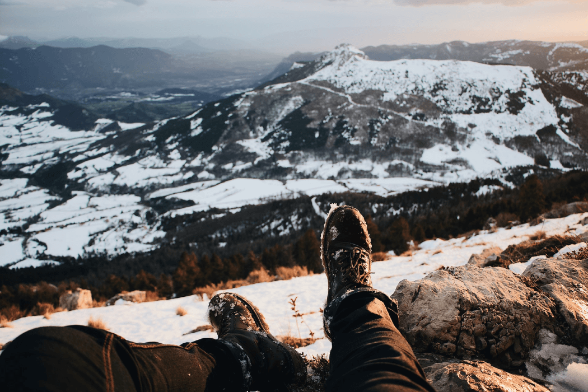

{ loading=lazy }

# Podsumowanie

Mamy nadzieję, że choć częściowo skorzystacie z naszych porad i doświadczeń, ale liczymy też, że pomożecie nam współtworzyć ten poradnik, przesyłając do nas wasze osobiste wnioski i przemyślenia dotyczące biwakowania i wędrowania w terenie! 

Zachęcamy do kontaktu:

4ldw.czarnaczworka@gmail.com

## Wspomniane oraz dodatkowe materiały i linki:

### Ogólne

O'Bannon, Allen et al. *Sztuka Wędrowania Z Plecakiem I Biwakowania W Terenie*. Sklep Podróżnika, 2012.

### Leave No Trace

[7 Zasad Leave No Trace, ZHP - Wydział Specjalności G*K](http://specjalnosci.zhp.pl/specjalnosci-harcerskie/ekologiczna/7-zasad-leave-no-trace/){target=_blank}

[Protect The Outdoors - Leave No Trace Center For Outdoor Ethics](https://lnt.org/){target=_blank}

### Planowanie trasy i podróż

[Policzmy swój ślad, czyli w jaki sposób podróżować ](https://post-turysta.pl/artykul/policzmy-swoj-slad){target=_blank}

[Jak Zaplanować Trasę Wędrówki Po Górach? ](https://blog.sklepiguana.pl/gory-dla-poczatkujacych-zaplanowac-trase-gorach){target=_blank}

[Mapa Turystyczna](https://mapa-turystyczna.pl/){target=_blank}

[Map Meurisse](https://map.meurisse.org){target=_blank}

[OpenStreet Map](http://www.openstreetmap.org){target=_blank}

[Mapy Geoportal](https://mapy.geoportal.gov.pl/){target=_blank}

[Bank Danych o Lasach Państwowych](https://www.bdl.lasy.gov.pl/portal/mapy){target=_blank}

[Kalkulator szlaków](https://www.szlaki.net.pl/kalkulator.php){target=_blank}

### Jedzenie

 [Performance Nutrition for Backpacking](https://www.youtube.com/watch?v=iqgayipoNWA){target=_blank} - filmik o planowaniu żywienia w czasie dłuższych wypraw z plecakiem

### Ultralight

[Lighterpack](https://lighterpack.com/welcome){target=_blank} to strona do tworzenia zestawień wagowych sprzętu.

[JupiterHikes](https://www.youtube.com/channel/UCTY6PJNvuO49nIG-aWSVLJQ){target=_blank} tworzy filmy o ultralight.

[Darwin onthetrail ](https://www.youtube.com/channel/UC18exdGWh7piVWisrnDXiZg){target=_blank} również produkuje materiały o ultralight.

[Andrew Skurka](https://andrewskurka.com){target=_blank} prowadzi bloga, pisze poradniki i projektuje sprzęt ultralight.

[Forum ultralight](https://www.reddit.com/r/Ultralight/){target=_blank} to żywa społeczność i bank wiedzy oraz doświadczeń.

Clelland, Mike, and Anna Haman. *Sztuka Minimalizmu W Podróży*. Wydawnictwo Sklepu Podróżnika, 2016.

[wstecz](/Wtrakciewypoczynku){ .md-button }

