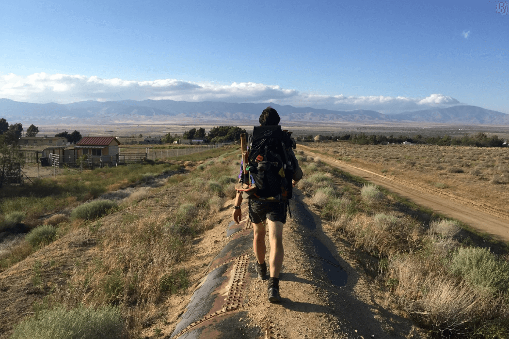
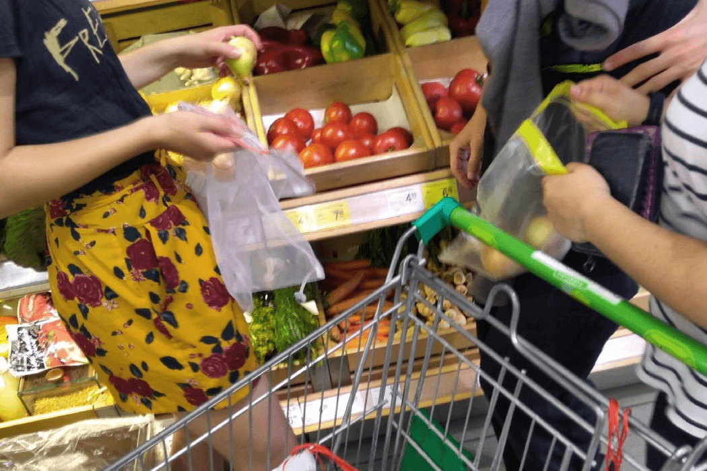
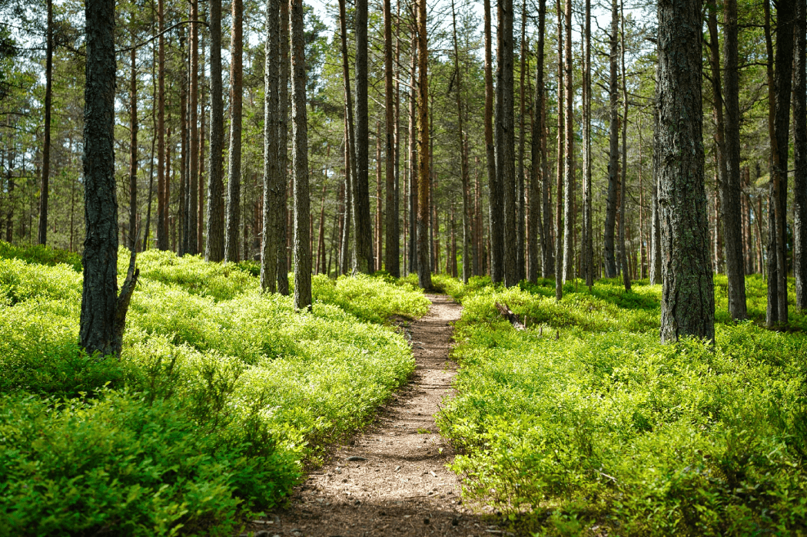

{ loading=lazy }

# Wędrowanie

## Posiłki i zakupy

<!-- { loading=lazy } -->

Często na trasie nie znajdziecie tanich restauracji. W takiej sytuacji najlepiej zrobić dłuższy postój, aby przygotować coś samemu. Warto przy tym zauważyć, że nie trzeba nosić ze sobą sobą składników na wszystkie obiady. Przy odpowiednim zaplanowaniu trasy prawie każdego dnia można zajść do sklepu i kupić potrzebne do przygotowania obiadu rzeczy. Przy zakupach pamiętajcie, aby starać się nie kupować żywności w plastikowych opakowaniach, a tym bardziej warzyw w woreczkach foliowych. W zastępstwie możecie użyć wielorazowych woreczków strunowych oraz siatek materiałowych. 
Każdy z was potrzebuje również wody, która sprzedawana jest w plastikowych butelkach. Są jednak trzy sposoby, aby zmniejszyć produkcję plastiku. Najlepsza będzie butelka z filtrem membranowym, który pozwoli wam bezpiecznie pić wodę zarówno z kranu, jak i z okolicznych strumieni. Trzeba przy tym pamiętać, że każdy filtr ma swoje granice przepuszczalności i jeżeli bierzecie wodę z jakiegoś cieku wodnego, to im bliżej źródła tym lepiej, żeby uniknąć spożycia groźnych mikroorganizmów np. wirusów. Drugą opcją jest butelka z filtrem węglowym, która jednak nadaje się tylko do filtrowania wody kranowej, zdatnej do picia. Najmniej zadowalającą opcją, ale wciąż lepszą niż kupowanie butelki wody dla każdego, jest kupienie pięcio- lub sześcio-litrowej butelki i rozlanie jej zawartości do własnych pojemników na płyny.

## Wędrówka

{ loading=lazy }

Wędrówka jest świetnym narzędziem do aktywnego poznawania przyrody i otaczającego świata. Żebyście nie tylko wy mogli go podziwiać, starajcie się zostawić wszystkie miejsca takimi, jakie zastaliście. Oczywiście chodzi tu nie tylko o zaśmiecanie, dlatego warto spojrzeć na problem szerzej. Niech waszą pierwszą zasadą będzie chodzenie jedynie po wyznaczonych ścieżkach. Nie stosując się do niej niszczycie roślinność, czyli krajobraz. Dodatkowo możecie przypadkowo natknąć się na legowisko dzikich zwierząt. W najlepszym przypadku nic tam nie znajdziecie poza śladami odchodów i resztek pożywienia, ale zostawicie swój zapach, przez co dane zwierzę już nie wróci w to miejsce. W gorszym dla was przypadku możecie się natknąć na samicę z młodymi, która czując zagrożenie, przystąpi do obrony młodych. 

W lesie starajcie się zachować ciszę, żeby nie płoszyć zwierząt. Czasem warto odłożyć telefon i oglądając swoje otoczenie kontemplować. Tematy do rozważania zawsze się znajdą. Wyjątkiem od tej reguły będzie miejsce potwierdzonego bytowania niedźwiedzi lub wilków, wówczas, żeby uniknąć konfrontacji zaznaczcie swoją obecność na szlaku rozmową o zwyczajnej głośności, a zwierzęta same powinny oddalić się na bezpieczną odległość.

 Aby zrozumieć miejsce, w którym jesteście warto również zapoznać się z jego historią i kulturą. Nie koniecznie musicie zachodzić do wszystkich możliwych muzeów na trasie, ale jeśli widzicie np. cmentarz wojenny, pomnik czy tabliczkę, to warto się zatrzymać - choćby na 5 minut, żeby zapoznać się z jej treścią.
Przy wędrówce z ciężkim plecakiem warto wspomagać się kijkami trekkingowymi, żeby odciążyć nieco stawy kończyn dolnych i uniknąć później ich bolesności.
Jeżeli idziecie jakimś szlakiem, to każde źle oznakowane miejsce zgłaszajcie do regionalnego oddziału PTTK. Pomoże to innym wędrowcom i jest możliwość, że zapobiegniecie wydeptywaniu nowych ścieżek.

Na koniec warto zwrócić uwagę na szczególne miejsce wędrówki - Parki Narodowe. W tych miejscach pod żadnym pozorem nie rozbijajcie namiotów i nie rozpalajcie ognisk, zwróćcie też uwagę na komunikaty i regulamin, które znajdziecie przy wejściu na teren PN. Sprawdźcie czy wejście jest płatne - nawet, jeśli nie ma bramki z osobą wydającą bilety niektóre parki korzystają z systemu elektronicznych biletów przez aplikację, tak jak np. Magurski PN. Warto wtedy mieć przy sobie naładowany telefon z internetem i dokonać zakupu biletu online, żeby nie zapłacić mandatu w czasie patrolowania terenu przez straż parku. Bądźcie też przygotowani na brak zasięgu na trasie, najlepiej zakupcie bilety dzień wcześniej, zanim wejdziecie na teren PN.

## Noclegi oraz czystość i higiena

Sen jest nieodłączną częścią ludzkiego życia. Jeżeli podczas wędrówki zdecydujcie się rozbić namioty, zwróćcie uwagę czy nie znajdujecie się w Parku Narodowym, na prywatnej posesji ,czy może w lesie, w miejscu nieprzeznaczonym do biwakowania**. **Obecnie Lasy Państwowe wyznaczyły miejsca w 45 oddziałach leśnych w całej Polsce, w których grupa do 9 osób może biwakować przez jedną lub dwie noce. Zweryfikujcie wcześniej na stronie bdl.lasy.gov.pl, czy na waszej trasie jest takie miejsce i sprawdźcie regulamin korzystania z pilotażu "Zanocuj w lesie"*.

Oprócz snu do potrzeb fizjologicznych należy również wypróżnianie się. Przy tej czynności zwracajcie uwagę, żeby oddalić się od wszelkich cieków wodnych na minimum 100 metrów i od miejsca obozowania. Odchody i szary papier toaletowy należy zakopać w ziemi przy użyciu saperki. Tak jak podczas wędrówki - zostawiajcie miejsce takim, jakim je zastaliście.

W tym punkcie należy też wspomnieć o śmieciach, wspominaliśmy już, żebyście ograniczyli produkcję odpadów, ale zdajemy sobie sprawę, że czasem jest to po prostu niemożliwe. Na takie konieczności przygotujcie jeden mały woreczek przytroczony do plecaka na śmieci pojawiające się na szlaku, które możecie zabrać ze sobą oraz na śmieci osobiste. Drugi worek (nieco większy) przeznaczcie na śmieci wspólne np. resztki z gotowania. Wszystkie odpady zgromadzone w trakcie wędrówki musicie zanieść do najbliższych osiedli ludzkich i zostawić w odpowiednim kontenerze lub pojemniku. Wybierajcie kontenery znajdujące się na terenach użytku publicznego np.: przy przystankach autobusowych, szkołach, kościołach, sklepach lub przy cmentarzach.

Pilnujcie siebie nawzajem - nie każdy ma na tyle silną wolę i poczucie odpowiedzialności, żeby schylić się po papierek, który mu upadł. Zwracajcie uwagę czy środki czystości, których używacie są na pewno nieszkodliwe dla środowiska. Nie zawsze będzie miejsce, gdzie można się umyć. Wtedy najlepiej użyć roztworu naturalnego mydła z dużą ilością wody, żeby zmyć z siebie pobieżnie kurz i pot, a następnie wytrzeć się do sucha małym ręcznikiem. W ostateczności można użyć biodegradowalnych chusteczek nawilżanych, jednak pamiętajcie, że to generuje kolejne odpady, które trzeba po użyciu umieścić w worku na śmieci i wyrzucić do odpowiedniego kontenera po zejściu ze szlaku.

*Dane pochodzą z marca 2021 roku, należy na bieżąco weryfikować ich poprawność.

[wstecz](/Przygotowanie){ .md-button }
[dalej  :fontawesome-solid-arrow-right:](/Podsumowanie){ .md-button .md-button--primary }
